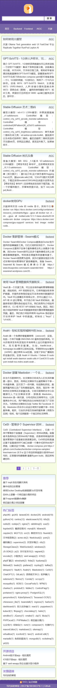

# 基于 Nuxt3 的响应式 Blog


### 流行的静态网站托管平台

- [GitHub Pages](https://pages.github.com/) 
- [Vercel](https://www.vercel.com/) -> https://cuiwei-net.vercel.app
- [Netlify](https://www.netlify.com/) -> https://cuiwei-net.netlify.app
- [Render](https://www.render.com/)
- [Railway](https://railway.app/)
- [Heroku](https://www.heroku.com/)

## 截屏





启动服务端
```
npm install pm2 -g

pm2 start ecosystem.config.cjs
```
## Setup

Make sure to install the dependencies:

```bash
# npm
npm install

# pnpm
pnpm install

# yarn
yarn install

# bun
bun install
```

## Development Server

Start the development server on `http://localhost:3000`:

```bash
# npm
npm run dev

# pnpm
pnpm run dev

# yarn
yarn dev

# bun
bun run dev
```

## Production

Build the application for production:

```bash
# npm
npm run build

# pnpm
pnpm run build

# yarn
yarn build

# bun
bun run build
```

Locally preview production build:

```bash
# npm
npm run preview

# pnpm
pnpm run preview

# yarn
yarn preview

# bun
bun run preview
```

Check out the [deployment documentation](https://nuxt.com/docs/getting-started/deployment) for more information.
